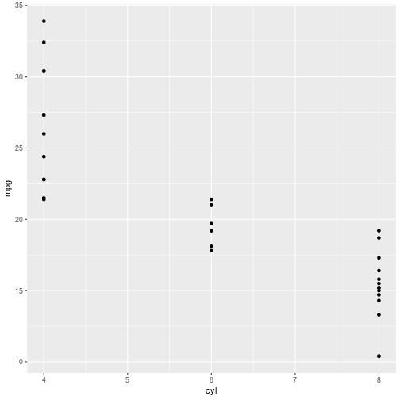
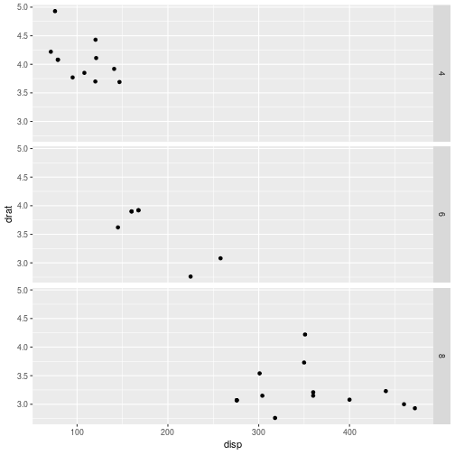

Tidy Evaluation
========================================================
author: Wim van der Ham
autosize: true

Example of Duplication
========================================================


```r
df1 %>% group_by(x1) %>% 
  summarise(mean = mean(y1))
df2 %>% group_by(x2) %>% 
  summarise(mean = mean(y2))
df3 %>% group_by(x3) %>% 
  summarise(mean = mean(y3))
df4 %>% group_by(x4) %>% 
  summarise(mean = mean(y4))
```

Write a Function to Reduce Duplication
========================================================


```r
library(tidyverse)
grouped_mean <- function(data, group_var, summary_var) {
  data %>%
    group_by(group_var) %>%
    summarise(mean = mean(summary_var))
}
```

But does not Work...
========================================================


```r
grouped_mean(mtcars, cyl, mpg)
```

What Works
========================================================


```r
grouped_mean <- function(data, group_var, summary_var) {
  group_var <- enquo(group_var)
  summary_var <- enquo(summary_var)
  data %>%
    group_by(!!group_var) %>%
    summarise(mean = mean(!!summary_var))
}
```


```r
grouped_mean(mtcars, cyl, mpg)
```

```
# A tibble: 3 x 2
    cyl  mean
  <dbl> <dbl>
1     4  26.7
2     6  19.7
3     8  15.1
```

Why?
========================================================

R has two types of functions

1. **Evaluation functions**, takes the values of the arguments
1. **Quoting functions**, takes the expression itself for later evaluation

Examples of an Evaluation Function
========================================================


```r
identity(6)
```

```
[1] 6
```

```r
identity(2 * 3)
```

```
[1] 6
```

```r
a <- 2
b <- 3
identity(a * b)
```

```
[1] 6
```

Examples of an Quoting Function
========================================================


```r
quote(6)
```

```
[1] 6
```

```r
quote(2 * 3)
```

```
2 * 3
```

```r
quote(a * b)
```

```
a * b
```

***


```r
~2 * 3
```

```
~2 * 3
```

```r
"a * b"
```

```
[1] "a * b"
```

Probably you know this Already
========================================================

**Quoting function**


```r
mtcars$mpg
```

```
 [1] 21.0 21.0 22.8 21.4 18.7 18.1 14.3 24.4 22.8 19.2 17.8 16.4 17.3 15.2
[15] 10.4 10.4 14.7 32.4 30.4 33.9 21.5 15.5 15.2 13.3 19.2 27.3 26.0 30.4
[29] 15.8 19.7 15.0 21.4
```

***

**Evaluating function**


```r
var <- "mpg"
mtcars[[var]]
```

```
 [1] 21.0 21.0 22.8 21.4 18.7 18.1 14.3 24.4 22.8 19.2 17.8 16.4 17.3 15.2
[15] 10.4 10.4 14.7 32.4 30.4 33.9 21.5 15.5 15.2 13.3 19.2 27.3 26.0 30.4
[29] 15.8 19.7 15.0 21.4
```

Is a Function is Evaluating or Quoting?
========================================================

**Quoting**


```r
temp <- "dplyr"
library(temp)
```


```r
temp <- cyl == 4
mtcars %>%
  filter(temp)
```


```r
mtcars2 <- mtcars
temp <- "mtcars2"
rm(temp)

exists("mtcars2")
exists("temp")
```

***

**Evaluating**


```r
temp <- mtcars$am
sum(temp)
```

Ok, so what now?
========================================================

Evaluating functions are easier to use because they support both direct and indirect references.

**But** most functions in the `tidyverse` are quoting functions.

For quoting functions we need the ability of unquoting arguments.

Quoting Variable
========================================================


```r
x_var <- quote(cyl)
y_var <- quote(mpg)

x_var
```

```
cyl
```

```r
y_var
```

```
mpg
```

Unquoting in dplyr
========================================================


```r
mtcars %>%
  group_by(!!x_var) %>% 
  summarise(mean = mean(!!y_var))
```

```
# A tibble: 3 x 2
    cyl  mean
  <dbl> <dbl>
1     4  26.7
2     6  19.7
3     8  15.1
```

Unquoting in ggplot
========================================================


```r
ggplot(mtcars) +  
  geom_point(aes(!!x_var, !!y_var))
```



Unquoting in ggplot for facet_wrap()
========================================================


```r
ggplot(mtcars, aes(disp, drat)) +
  geom_point() +
  facet_grid(vars(!!x_var))
```



qq_show() for debugging dplyr
========================================================


```r
rlang::qq_show(
  mtcars %>% 
  group_by(!!x_var)
)
```

```
mtcars %>% group_by(cyl)
```

```r
rlang::qq_show(
  mtcars %>% 
  summarise(mean = mean(!!y_var))
)
```

```
mtcars %>% summarise(mean = mean(mpg))
```

qq_show() for debugging ggplot
========================================================


```r
rlang::qq_show(
  ggplot(mtcars, aes(!!x_var, !!y_var))
)
```

```
ggplot(mtcars, aes(cyl, mpg))
```

```r
rlang::qq_show(
  facet_grid(vars(!!x_var))
)
```

```
facet_grid(vars(cyl))
```

quote() vs enquo()
========================================================

While `quote()` quotes what *you* typed, `enquo()` quotes what your *user* typed. In other words it makes an argument automatically quote its input.

This works
========================================================


```r
grouped_mean <- function(data, group_var, summary_var) {
  group_var <- enquo(group_var)
  summary_var <- enquo(summary_var)
  data %>%
    group_by(!!group_var) %>%
    summarise(mean = mean(!!summary_var))
}
```


```r
grouped_mean(mtcars, cyl, mpg)
```

```
# A tibble: 3 x 2
    cyl  mean
  <dbl> <dbl>
1     4  26.7
2     6  19.7
3     8  15.1
```

Quoting for Strings
========================================================

These are **different**:


```r
"height"
```

```
[1] "height"
```

```r
quote(height)
```

```
height
```

***

These are the **same**:


```r
sym("height")
```

```
height
```

```r
quote(height)
```

```
height
```

Grouped Function that Accepts Strings
========================================================


```r
grouped_mean2 <- function(data, group_var, summary_var) {
  group_var <- sym(group_var)
  summary_var <- sym(summary_var)

  data %>%
    group_by(!!group_var) %>%
    summarise(mean = mean(!!summary_var))
}
grouped_mean2(mtcars, "cyl", "mpg")
```

```
# A tibble: 3 x 2
    cyl  mean
  <dbl> <dbl>
1     4  26.7
2     6  19.7
3     8  15.1
```

Exercise
========================================================

Use the `flights` dataset from the `nycflights13` package

1. Write a function that plots the `arr_delay` against an other variable given by the user as an argument.
1. Write a for loop that calculates the mean value of every column in the dataset.
